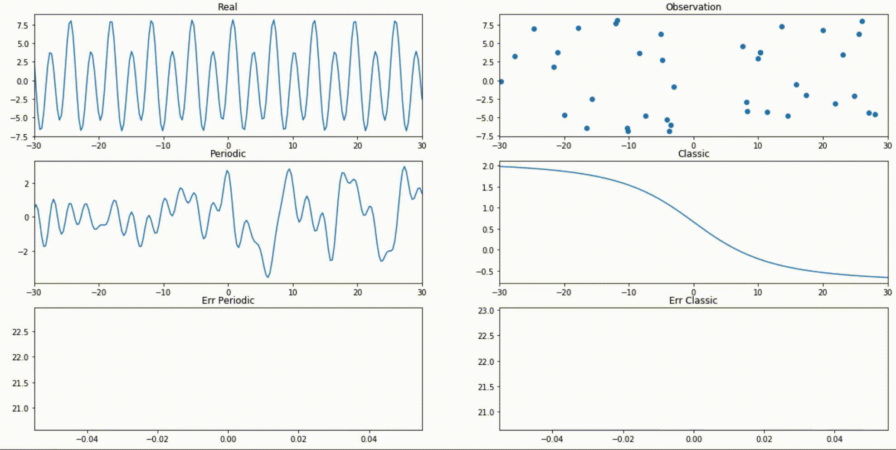

PerioNet!
---

a peroidic NN component, maybe useful when fitting perodic functions?

Here is a few comparisons to regular NN.

The regular NN has 60 hidden neurons
The perioNN has 10 components

In all the examples below the NNs were trained 100 times on the observed data using Adam at every iteration

the "Classic" is the regular NN in the plots

#### sin(x)

#### sin(x) + x + 4 * cos(x)

#### mixture of cos and sins over a big range

#### Exponential and Polynomial combination

